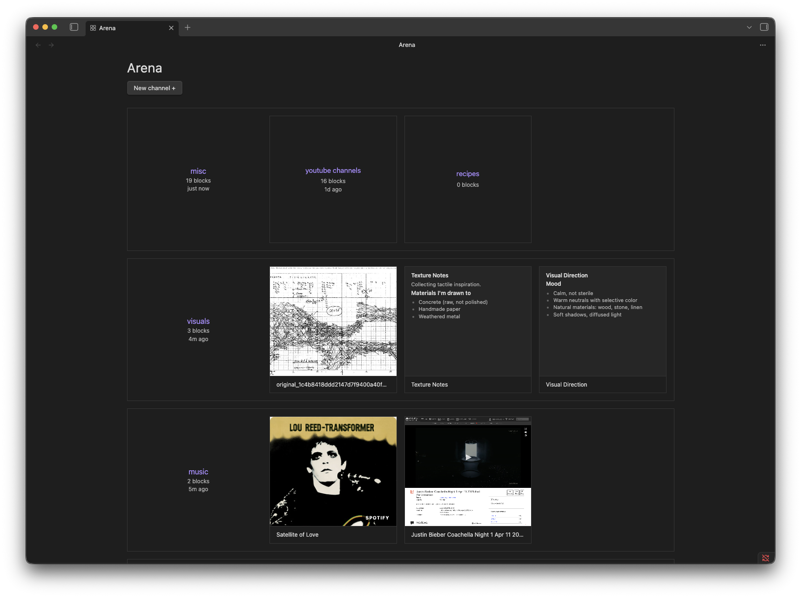

# Arena Browser

Browse Obsidian as [Are.na](https://www.are.na/) inspired channels and blocks — a visual interface to reference and organize files in your vault.



## Features

- Subfolders become **channels**, files inside them become **blocks**
- Images render as thumbnails, markdown files show text previews, everything else shows a filetype badge
- Drag files from Finder or your desktop directly into a channel
- Drag blocks between channels to reorganize
- Right-click channels and blocks for additional actions

## Installation

You can install the plugin via the Community Plugins tab within Obsidian. Search for "Arena Browser."

To install manually, copy `main.js`, `styles.css`, and `manifest.json` into your vault at `.obsidian/plugins/arena-browser/`, then enable the plugin in Settings → Community Plugins.

## Usage

After enabling the plugin, click the grid icon in the ribbon or use the Command Palette → **Open Arena browser**.

- **Create a channel**: Click **+ New channel** or use Command Palette → _Create new channel_
- **Add blocks**: Drag files from Finder or your desktop into a channel
- **Move blocks**: Drag blocks between channels in the browser
- **Open a file**: Click any block to open it in the editor

## Folder structure

Arena Browser maps directly to your vault's folder structure. By default it looks for a folder named `arena` at your vault root:

```
vault/
└── arena/
    ├── design-resources/
    │   ├── screenshot.png
    │   └── notes.md
    └── mood-board/
        └── reference.pdf
```

## Settings

- **Root folder**: The vault folder Arena Browser treats as its top level (default: `arena`)

## Network usage

Arena Browser makes outbound network requests in the following situations:

- **URL bookmarks** — when you paste or drop an HTTP/HTTPS URL into a channel, the plugin fetches the page to read its `<title>` and Open Graph metadata (`og:title`, `og:description`, `og:image`). No data is sent; only an outbound GET is made to the URL you provided.
- **Spotify & SoundCloud cover art** — for links from `open.spotify.com` and `soundcloud.com`, the plugin calls the platform's public oEmbed endpoint to retrieve the cover thumbnail URL, then downloads that image.
- **Screenshot previews (optional)** — if you build the plugin with an `APIFY_TOKEN` set in your `.env` file, cover images for bookmarks are fetched via the [Apify](https://apify.com) screenshot API. No token is bundled in a release build unless you explicitly add one yourself.

No analytics, telemetry, or tracking of any kind are collected or transmitted.

## License

MIT — see [LICENSE](LICENSE).
